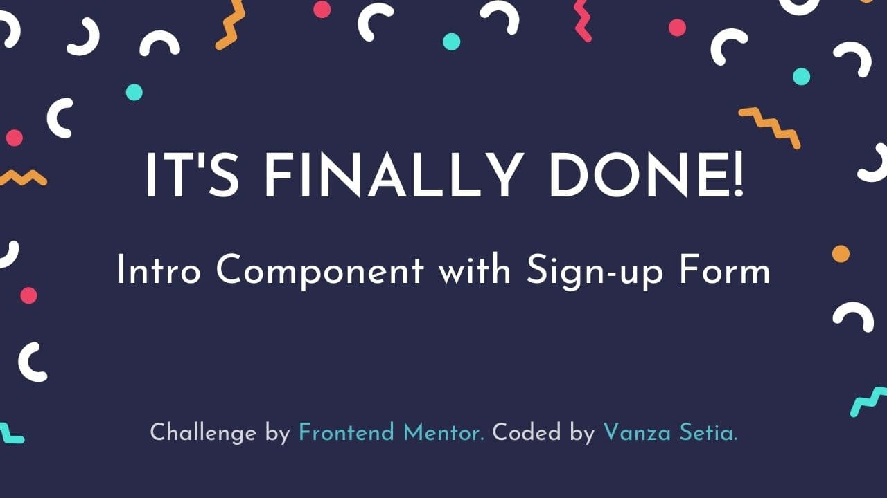
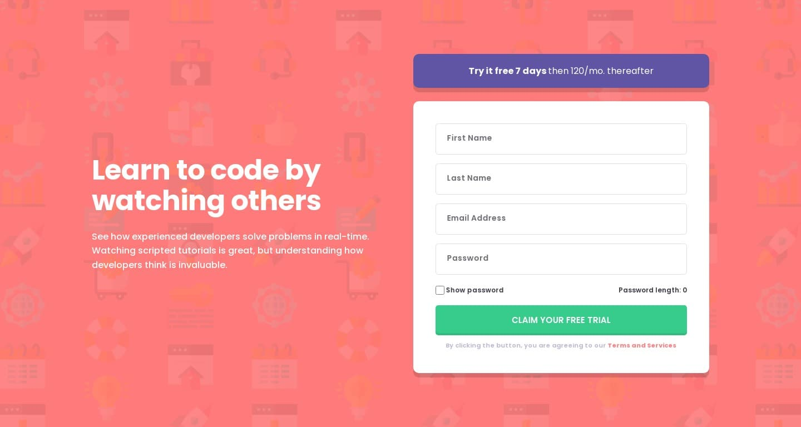

<p align="left">
  <a href="https://www.frontendmentor.io/challenges?difficulties=1" target="_blank"></a>
  
  <a href="https://twitter.com/vanzasetia" target="_blank"></a>
  
  
  
</p>

<p>
  <a href="http://jigsaw.w3.org/css-validator/validator?lang=en&profile=css3svg&uri=https%3A%2F%2Fofficialmentor.netlify.app%2F&usermedium=all&vextwarning=&warning=1">
    
    </a>
    <a href="https://github.com/standard/semistandard">
      
    </a>
</p>

# Intro Component with Sign-up Form

## Table of contents
- [Overview](#overview)
  - [Introduction](#introduction)
  - [The challenge](#the-challenge)
  - [Links](#links)
  - [Screenshots](#screenshots)
- [My process](#my-process)
  - [Built with](#built-with)
  - [What I learned](#what-i-learned)
  - [Useful resources](#useful-resources)
- [Author](#author)
- [Acknowledgements](#acknowledgements)
- [License](#license)
- [References](#references)

## Overview
[(Back to top)](#table-of-contents)

### Introduction
Welcome to the `README.md` of this repo! The purpose of creating this project is to sharpen my coding skill.

In this file, I'm going to tell you everything starting from the tools that I used, and much more.

That's it for the introduction and **happy reading!**
### The Challenge
My challenge is to build out this landing page and get it looking as close to the design as possible.

My users should be able to:

- View the optimal layout for the site depending on their device's screen size
- See hover states for all interactive elements on the page
- Receive an error message when the form is submitted if:
  - Any input field is empty
  - The email address is not formatted correctly
- Toggle the password visibility
- Know the length of their password (without making them count it by themselves) 

### Links
- [Live Review](https://officialmentor.netlify.app/)
- [Frontend Mentor Solution Page]()

### Screenshots



## My Process
[(Back to top)](#table-of-contents)

### Built With
- **Following best practices**\* 
- Semantic HTML
- [BEM (Block, Element, Modifier)](https://sparkbox.com/foundry/bem_by_example) Class *Naming Convention*
- [Sass](https://sass-lang.com/)
- JavaScript
- CSS Flexbox
- Mobile-first workflow

> \* I follow guidelines. [See what guidelines that I follow.](./docs/README.md#guidelines)

### What I Learned

#### User Story

The [definition of the "User story" from wikipedia](https://en.wikipedia.org/wiki/User_story) is the following:
> [...] **user story** is [...] natural language description of features of a software system.

It means that this is just the way for a developer to **explain a feature from a user’s point of view**. Usually, a user story is written from the user’s perspective and follows the format: “As [a user persona], I want [to perform this action] so that [I can accomplish this goal].”

I have two users that I test this site. I tested it myself and my mother.

#### First User Story (Myself)
So, I struggling to remember what I've just written on the password input. As a result, I have a story that goes like this.

> As a user, I want to be able to see the password that I've written so that I know what I wrote.

Now, after I know the problem then I create the "Show password" checkbox where it will change the type of the input to a text when it is checked. This way, I can easily know what I've written previously before I submit the form.

#### Second User Story (My Mother)
I don't have any problem filling the form after I add the "Show password" functionality so I would know how other users' experiences or stories when they try to fill the form. My mother easily fills the first name, last name, and email input. However, my mother has two problems when she tries to fill in the password input.

- First, she didn't know what kind of symbols she has to put to make the password valid.
- Second, she had a problem where she had to count the password herself because she keeps getting the alert message every time she clicked the submit button.

So, based on this problem I can create two user stories that look like this.

- First, As a user, I want to be able to know the exact symbols that are required for the password to be valid.
- Second, as a user, I want to be able to know the exact length of the password that I've written so that I don't need to count it by myself.

As a result, I improved the alert message for the password by telling the user the exact symbols that the user has to use for a valid password.

```diff
- Use 12 or more characters with only a mix of lowercase and uppercase letters, numbers & symbols
+ Use 12 or more characters with only a mix of lowercase and uppercase letters, numbers & symbols (!@#$%^&*)
```

Then I added a new feature where the user can see the password length easily.

#### Separation of Concerns

What is **Separation of Concerns**?

Separation of concerns is one of the programming principles which ensures that a "thing" is only responsible for itself and nothing else. For example, as a developer, I should be able to focus on one thing without worrying about anything else. In this case, I should be able to focus on accessibility without worrying about the styling and the functionality. Then, when I work with the CSS, I should be able to work with the CSS without breaking the functionality or caring how the HTML structure.

So, if I disobey this principle, for example, let's say I have HTML markup that looks like this.

```html
<main>
  <h1>Hello World!</h1>
  <p>Welcome to this world!</p>
</main>
```

Then my CSS should look like this. (This is a really bad CSS)

```css
main {
  background-color: #111;
}

main > h1 {
  color: #fff;
}

main > p {
  color: #fff;
  font-size: 1.2rem;
}
```

If I write CSS selectors like that, it means that I can't work or **only focus** on HTML without worrying or breaking the styling. It makes my CSS difficult to refactor if the HTML markup changes in the future. For example, I change the HTML to something like this.

```html
<main>
  <div>
    <h1>Hello World!</h1>
    <p>Welcome to this world!</p>
  </div>
</main>
```

Then the styling will be completely broken which means that every time I change the HTML markup, I have to remember to change my CSS too.

So, if I follow the separation of concerns principle, I should add classes **only for styling**.

```html
<main class="hero">
  <h1 class="hero__title">Hello World!</h1>
  <p class="hero__description">Welcome to this world!</p>
</main>
```

Then, the CSS should look like this.

```css
.hero {
  background-color: #111;
}

.hero__title {
  color: #fff;
}

.hero__description {
  color: #fff;
  font-size: 1.2rem;
}
```

It is much more scalable because the styling won't break if I change my HTML.

This way, I can change or work with my HTML without worrying about the styling. So, if I add a `div`, then the styling will not be broken.

```html
<main class="hero">
  <div class="container">
    <h1 class="hero__title">Hello World!</h1>
    <p class="hero__description">Welcome to this world!</p>
  </div>
</main>
```

The same goes with JavaScript, let's say I add a button and, I want to work with it in my JavaScript then by following the separation of concerns principle, I need to have a special class that is only for this purpose which is the `js-` class name.

```html
<main class="hero">
  <div class="container">
    <h1 class="hero__title">Hello World!</h1>
    <p class="hero__description">Welcome to this world!</p>
    <button type="button" class="hero__button js-toggleButton">Click me!</button>
  </div>
</main>
```

In JavaScript, I can simply grab the button by using the `js-toggleButton` class.

```javascript
const toggleButton = document.querySelector(".js-toggleButton")

// do something awesome...
```

So, separation of concerns is helpful and makes me easily work with one thing without destroying other things when working with one of these things.

**Now, the actual practice that I do is the following.**

I see most people do something like this where the JavaScript depends on the HTML structure.

```javascript
const displayError = input => {
  const errorElement = input.nextElementSibling
  errorElement.innerText = 'Hey, please fill the input';
  input.classList.add("error");
};
```

Assuming the HTML **always** like this which in real world project, things will change.

```html
<label>
  First Name
  <input type="text">
  <span> class="alert"></span>
</label>
```

The problem with the above code is that if I need to move to the alert paragraph somewhere else then I need to remember to change the JavaScript as well. This is against the separation of concerns principle.

**So, here's what I did.**

I added a `data-id` attribute to both `input` and the `alert` element and then check if the value of the `data-id` on the input has the same value as the value of the `data-id` on the alert element then show the alert. This JavaScript is not going to break even though I change the structure of the HTML markup which means that I can focus on working or refactoring the HTML without worrying it will break the functionality.

```javascript
const handleAlert = input => {
  const alerts = document.querySelectorAll(".js-alert");
  alerts.forEach(alert => {
    const inputID = input.dataset.id;
    const alertID = alert.dataset.id;
    if (inputID === alertID) {
      showAlertMessage(alert, input);
      hideAlertMessage(alert, input);
    }
  });
};
```

> If you have any feedback feel free to write it on the solution page. 😉

*By writing my code in this file, I might be against the principle which means that if I change my code on the source code, I need to remember to change the code right here.*

### Useful Resources
- [JavaScript Password RegEx by Harish Chaudhari](https://gist.github.com/HarishChaudhari/0dd5514ce430991a1b1b8fa04e8b72a4) - This helps me validate the user password input. It makes sure that the user writes a strong password.
- [RegExr](https://regexr.com/) - This tool helps me learn and eventually create my RegEx to validate users' inputs.

## Author
[(Back to top)](#table-of-contents)

- Frontend Mentor - [@vanzasetia](https://frontendmentor.io/profile/vanzasetia)
- Twitter - [@vanzasetia](https://twitter.com/vanzasetia)
- Code Newbie - [@vanzasetia](https://community.codenewbie.org/vanzasetia)
- Want to see me on other platform? [Check my linktree!](https://linktr.ee/vanzasetia)

## Acknowledgements
[(Back to top)](#table-of-contents)

The password RegEx is a copy-paste from [a gist](https://gist.github.com/HarishChaudhari/0dd5514ce430991a1b1b8fa04e8b72a4) by [@HarishChaudhari](https://gist.github.com/HarishChaudhari).

Here's the difference between my RegEx and his RegEx. I increased the minimum number of characters from 8 to 12.

```diff
- /^(?=.*[\d])(?=.*[A-Z])(?=.*[a-z])(?=.*[!@#$%^&*])[\w!@#$%^&*]{8,}$/
+ /^(?=.*[\d])(?=.*[A-Z])(?=.*[a-z])(?=.*[!@#$%^&*])[\w!@#$%^&*]{12,}$/
```

I want to say thank you to [Grace Snow](https://www.frontendmentor.io/profile/grace-snow) for helping me to improve the solution by pointing two issues that the site have.
- First, the layout was broken on her view, the "show password" checkbox and the "Password length" become two lines. I followed her suggestion where I made the show password checkbox into an eye icon in the password input. Now, the issue should be solved.
- Second, the alert messages were too long and disappeared really fast. So, I made the alert messages short and concise and made the alert messages exist on the page until the user submit the form.

## License
[(Back to top)](#table-of-contents)

>You can check out [the full license](./LICENSE)

This project is licensed under the terms of the MIT license.

For those of you who are wondering, why do I need to license this? 
- Well, first it's free. 😆
- Second I checked this [Choose license website](https://choosealicense.com/) to help me chose a license.
- The last reason, if I don't want to choose a license, then [here's what gonna happen](https://choosealicense.com/no-permission/).

## References

[(Back to top)](#table-of-contents)

> See the [documentation.](./docs/README.md)
